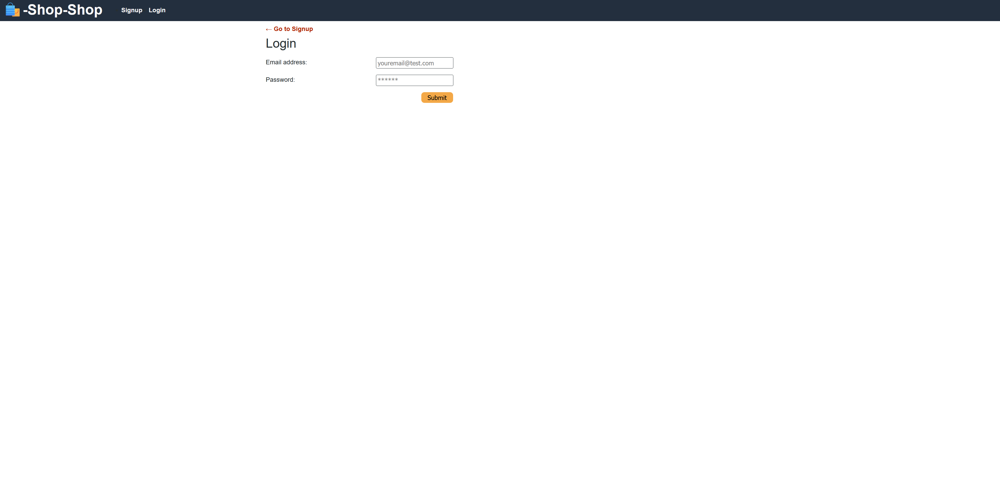

  # 22_Redux_State

  ## Description

    A refactoring challenge to implement Redux.

  ## Table of Contents 

  - [Installation](#installation)
  - [Usage](#usage)
  - [Screenshots](#screenshots)
  - [License](#license)

  ## Deployed Application
[Click Here](https://two2-redux-state.onrender.com)

  ## Installation

    Make sure all required npm packages are installed by running the command npm install. After the installation process has been completed, run the command npm run start. Open Google Chrome then navigate to localhost:3000/ to access the application.

  ## Usage

    Click the navbar to navigate to different pages. Add to cart, login, signup, click on products to see details, must be logged in to checkout using the stripe api. Click the trash icon to remove item from cart or if you are in the details page hit remove button.

  
  ## Screenshots

    This is the homepage populated with product cards
  

    This is the shopping cart after pressing the add to cart button.
  

    This is the details page.
  

    This is the login page.
  

    This is the signup page.
  
  
    This is the checkout page.
  

  ## License 
  ### Badge 
  

    
      MIT License

      Copyright (c) function getFullYear() { [native code] } 
      
      Permission is hereby granted, free of charge, to any person obtaining a copy
      of this software and associated documentation files (the "Software"), to deal
      in the Software without restriction, including without limitation the rights
      to use, copy, modify, merge, publish, distribute, sublicense, and/or sell
      copies of the Software, and to permit persons to whom the Software is
      furnished to do so, subject to the following conditions:
      
      The above copyright notice and this permission notice shall be included in all
      copies or substantial portions of the Software.
      
      THE SOFTWARE IS PROVIDED "AS IS", WITHOUT WARRANTY OF ANY KIND, EXPRESS OR
      IMPLIED, INCLUDING BUT NOT LIMITED TO THE WARRANTIES OF MERCHANTABILITY,
      FITNESS FOR A PARTICULAR PURPOSE AND NONINFRINGEMENT. IN NO EVENT SHALL THE
      AUTHORS OR COPYRIGHT HOLDERS BE LIABLE FOR ANY CLAIM, DAMAGES OR OTHER
      LIABILITY, WHETHER IN AN ACTION OF CONTRACT, TORT OR OTHERWISE, ARISING FROM,
      OUT OF OR IN CONNECTION WITH THE SOFTWARE OR THE USE OR OTHER DEALINGS IN THE
      SOFTWARE.
      

  https://choosealicense.com/licenses/mit/
  

  